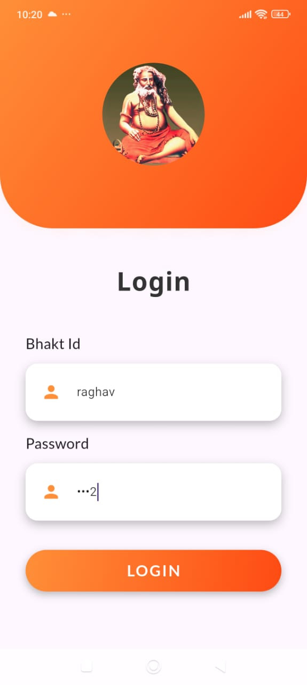
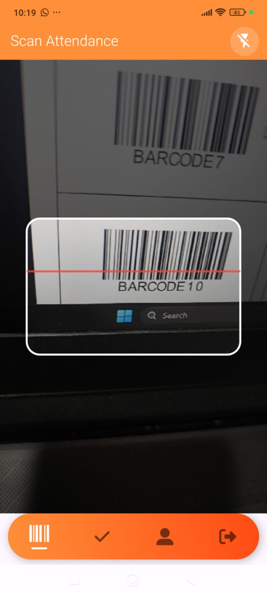
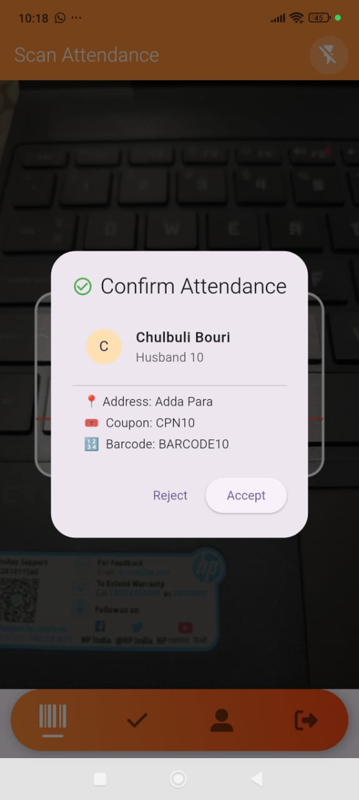
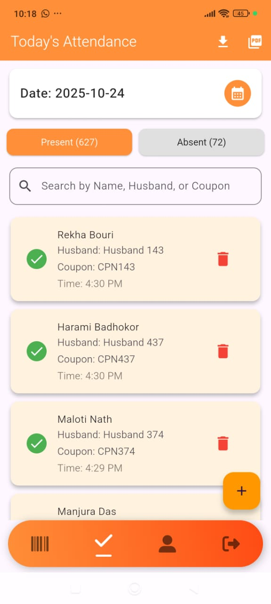
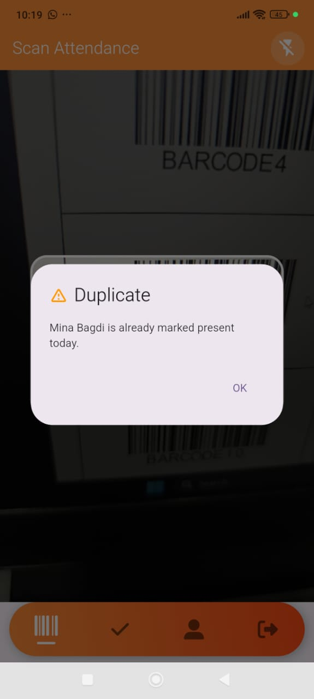
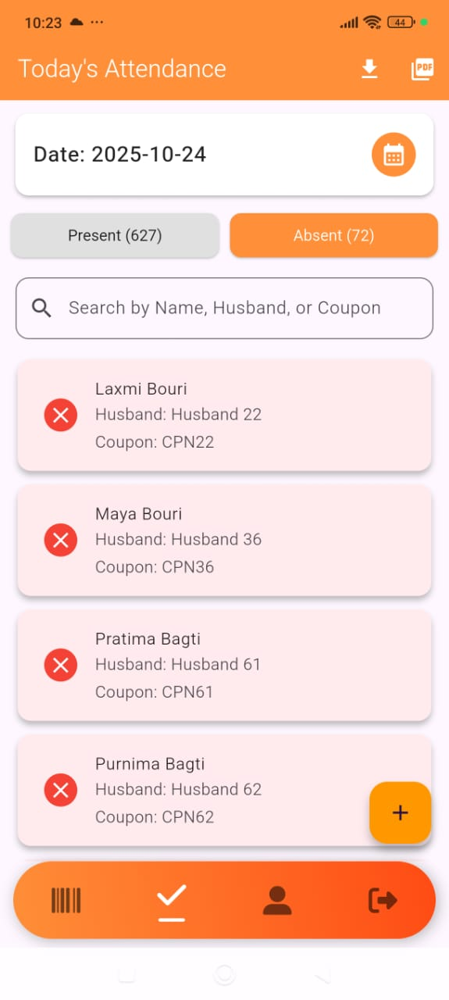
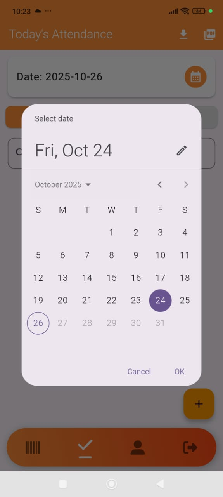
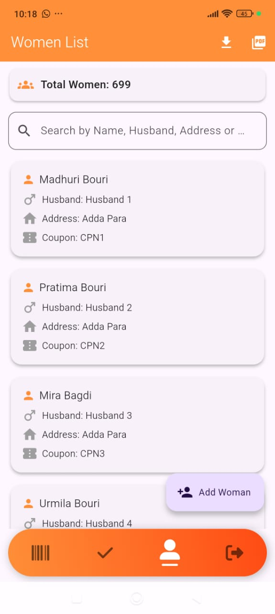
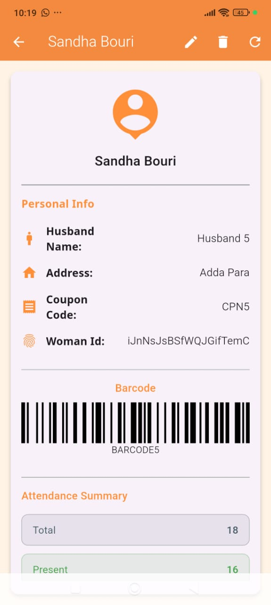
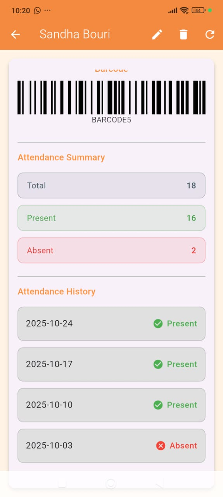

# 🙏 Gosaign - NGO Attendance Management System

**A Flutter-based attendance management system with barcode scanning for NGO distribution tracking.**

Gosaign is a specialized attendance and distribution tracking system designed for NGO operations. It helps manage beneficiary records, track item distribution, and prevent duplicate entries through barcode-based verification.

## 🌟 Overview

Gosaign addresses critical challenges in NGO distribution management:
- **Manual Record Keeping**: Digitizing beneficiary data and attendance
- **Duplicate Distribution**: Preventing multiple claims through barcode verification
- **Data Accessibility**: Role-based access for administrators and members
- **Real-time Tracking**: Instant attendance marking and daily reports
- **Accountability**: Transparent record of distribution activities

## ✨ Key Features

### 👥 Dual Role System

#### 🔐 Admin Account
- **Complete Access**: Full control over system operations
- **Beneficiary Management**: Create, edit, and delete beneficiary records
- **Barcode Generation**: Automatic unique barcode creation for each beneficiary
- **Attendance Marking**: Scan barcodes to mark daily attendance
- **Data Management**: Add new women with all required details
- **Full Data Access**: View all beneficiary information including barcodes
- **Distribution Tracking**: Monitor daily distribution activities

#### 👤 Member Account
- **View-Only Access**: Access beneficiary information (limited)
- **Barcode Scanning**: Mark attendance by scanning barcodes
- **Data Viewing**: See name, husband name, address, and coupon code
- **Attendance Reports**: View daily attendance lists
- **Restricted Access**: Cannot view or generate barcodes
- **No Edit Rights**: Cannot modify beneficiary data

### 📊 Beneficiary Data Management
- **Comprehensive Records**: Store complete beneficiary information
    - Full name
    - Husband's name
    - Complete address
    - Unique coupon code
    - Unique barcode
- **Search & Filter**: Quick search functionality
- **Data Validation**: Prevent duplicate entries
- **Secure Storage**: Cloud-based data protection

### 📱 Barcode System
- **Unique Identification**: Each beneficiary gets a unique barcode
- **Quick Scanning**: Fast attendance marking through barcode
- **Duplicate Prevention**: System alerts if same barcode scanned twice
- **Daily Reset**: Fresh tracking for each distribution day
- **Visual Feedback**: Immediate confirmation of scan success

### 📋 Attendance Tracking
- **Daily Attendance**: Mark presence for each distribution day
- **Real-time Updates**: Instant sync across all devices
- **Attendance List**: View all present beneficiaries for the day
- **Historical Data**: Access past attendance records
- **Export Reports**: Generate attendance reports for documentation

### 🚨 Duplicate Detection
- **Same-Day Prevention**: Alert if beneficiary tries to claim twice
- **Visual Alerts**: Clear notification for duplicate attempts
- **Audit Trail**: Log all scanning activities
- **Reporting**: List of all present beneficiaries

## 🎯 Use Case

**NGO Distribution Scenario:**
1. Admin creates records for 600+ beneficiary women
2. Each woman receives a unique barcode card
3. On distribution day:
    - Women arrive with their barcode cards
    - Staff (admin/member) scans the barcode
    - System marks attendance instantly
    - If woman tries to return, system alerts duplicate entry
4. End of day: Generate complete attendance report
5. Transparent distribution management with accountability

## 🛠️ Tech Stack

### Frontend Framework
- **Framework**: Flutter SDK
- **Language**: Dart
- **IDE**: Android Studio
- **UI**: Material Design Components
- **State Management**: Provider / setState

### Backend & Database
- **Backend**: Firebase
- **Database**: Cloud Firestore
    - Collection: `Gosai_bhakt`
    - Fields: id, name, husband_name, address, coupon_code, barcode, password, role
- **Authentication**: Custom login with role-based access
- **Storage**: SharedPreferences for local session management

### Barcode System
- **Scanner**: flutter_barcode_scanner
- **Generator**: barcode_widget / barcode
- **Format**: Code128 / QR Code
- **Printing**: Integration with label printers

### Key Packages
```yaml
dependencies:
  flutter:
    sdk: flutter
  cloud_firestore: ^4.13.0
  shared_preferences: ^2.2.2
  flutter_keyboard_visibility: ^6.0.0
  flutter_barcode_scanner: ^2.0.0
  barcode_widget: ^2.0.4
  qr_flutter: ^4.1.0
  pdf: ^3.10.0
```

## 📱 App Demonstration

### 1. Splash Screen


---

### 2. Login Screen


**Features:**
- Two input fields:
    - **Bhakt Id**: Username field
    - **Password**: 
- Role-based authentication that redirects users to appropriate dashboards
- Keyboard-aware interface that adjusts layout when keyboard appears

**Login Process:**
- Enter your unique Bhakt ID (e.g., "raghav")
- Enter your password
- System validates credentials against Firestore database
- Automatically routes to Admin or Member dashboard based on role

---

### 3. Barcode Scanner - Active Scanning


**Real-time Barcode Scanning:**
- Full-screen camera interface for scanning barcodes
- Live preview shows the barcode being scanned (BARCODE10 visible)
- Bottom navigation bar with four actions:
    - 🔲 **Scan**: Active scanning mode
    - ✓ **Verify**: Confirm scanned data
    - 👤 **Profile**: View beneficiary details
    - 🚪 **Logout**: Exit current session

**How it works:**
- Point camera at beneficiary's barcode card
- System automatically detects and reads barcode
- Instant validation against database
- Prevents duplicate scanning on same day

---

### 4. Attendance Confirmation Dialog


**Attendance Verification Screen:**

After scanning a barcode, the system displays a confirmation dialog with complete beneficiary details:

**Displayed Information:**
- ✅ **Status Icon**: Green checkmark indicates valid scan
- 👤 **Name**: Chulbuli Bouri
- 💑 **Husband Name**: Husband 10
- 📍 **Address**: Adda Para
- 🎫 **Coupon Code**: CPN10
- 🔲 **Barcode**: BARCODE10

**Action Buttons:**
- **Reject**: Cancel the attendance marking (if scanned by mistake)
- **Accept**: Confirm and mark attendance for the day

This dialog ensures accuracy before marking attendance and allows staff to verify the correct person before finalizing.

---

### 5. Today's Attendance - Present List


**Daily Attendance Dashboard:**

**Header Section:**
- 📅 **Date**: 2025-10-24 (current day)
- 📊 **Statistics**:
    - Present: 627 beneficiaries
    - Absent: 72 beneficiaries
- 🔍 **Search Bar**: Search by Name, Husband name, or Coupon code
- 📥 **Download**: Export attendance data
- 📄 **PDF**: Generate PDF report

**Attendance Cards (Present):**
Each card shows:
- ✅ **Green Checkmark**: Indicates present status

**Features:**
- Real-time updates as new attendance is marked
- Floating "+" button to manually add attendance
- Color-coded cards (cream background for easy readability)

---

### 6. Duplicate Detection Alert


**Duplicate Prevention System:**

When a beneficiary tries to scan their barcode twice on the same day, the system immediately shows a warning dialog:

**Alert Details:**
- ⚠️ **Warning Icon**: Yellow triangle with exclamation
- **Title**: "Duplicate"
- **Message**: "Mina Bagdi is already marked present today."
- **OK Button**: Dismiss the alert

**Background Context:**
The dialog appears over the active barcode scanner screen, preventing any further action until acknowledged. This critical feature prevents:
- Double distribution of items
- Fraudulent attendance claims
- Resource wastage
- System abuse

---

### 7. Today's Attendance - Absent List


**Absent Beneficiaries View:**

**Use Cases:**
- Track who missed distribution
- Follow-up with absent beneficiaries
- Identify patterns in attendance
- Plan for future distributions
- Generate reports for donors/stakeholders

---

### 8. Date Picker - Historical Attendance


**Historical Data Access:**

**Calendar Interface:**
- 📅 **Current Selection**: Fri, Oct 24 (highlighted in purple)
- **Month Navigation**: October 2025 with arrow controls
- **Today's Date**: Oct 26 (outlined in purple circle)
- **Selectable Dates**: All dates in the month available
- **Quick Access**: Select any past date to view historical attendance

**Features:**
- View attendance records from any previous day
- Compare attendance patterns over time
- Track beneficiary attendance frequency
- Audit past distribution days

---

### 9. Women List - All Beneficiaries


**Complete Beneficiary Database:**

**Beneficiary Cards:**
Each card contains:
- 👤 **Name**: Beneficiary's full name
- 💑 **Husband**: Husband's name/identifier
- 🏠 **Address**: Complete address (Adda Para)
- 🎫 **Coupon**: Unique coupon code

**Actions:**
- 👥 **Add Woman** (Floating button): Admin can add new beneficiaries
- Tap any card to view full details
- Scroll through all beneficiaries
- Real-time search filtering

---

### 10. Individual Beneficiary Profile (Part 1)


**Detailed Profile View - Personal Information:**

**Header:**
- **Name Title**: Sandha Bouri
- ✏️ **Edit**: Modify beneficiary details (admin only)
- 🗑️ **Delete**: Remove beneficiary (admin only)
- 🔄 **Refresh**: Reload latest data

**Personal Info Section:**

1. 👤 **Husband Name**: Husband 5
2. 🏠 **Address**: Adda Para
3. 🎫 **Coupon Code**: CPN5
4. 🆔 **Woman Id**: iJnNsJsBSfWQJGifTemC
    - Unique Firebase document ID
    - Used for internal tracking
    - Ensures data integrity

**Design Features:**
- Clean, card-based layout
- Update feature for updating the profile
- Icons for visual identification
- Easy-to-read typography
- White background for clarity

---

### 11. Individual Beneficiary Profile (Part 2)


**Detailed Profile View - Barcode & Attendance:**

**Attendance Summary:**

📊 **Statistics:**
1. **Total**:
    - Total number of distribution events held
2. **Present**:
    - 88.9% attendance rate
    - Excellent participation record
3. **Absent**:
    - Missed only 2 distributions

**Key Features:**
- Scrollable history showing all past dates
- Color-coded status indicators
- Date-wise attendance tracking
- Easy verification of participation
- Useful for:
    - Beneficiary eligibility verification
    - Attendance pattern analysis
    - Reward programs for regular attendees
    - Identifying those who need follow-up
---

**Made with ❤️ for social impact**

*Gosaign (गोसाईगन) - Empowering NGOs with digital distribution management*